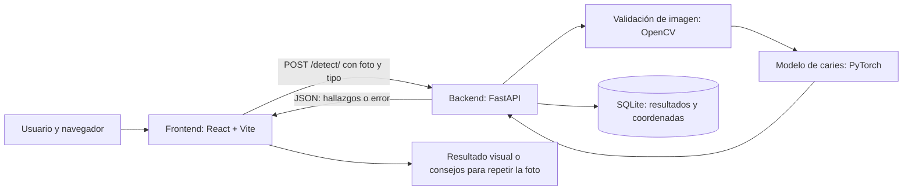

# Guía del proyecto Dental Screening

Esta guía describe **el estado actual del código**: qué hace la aplicación, por qué usa cada tecnología, cómo se organizan las carpetas y qué función cumple cada archivo. Complementa al [README.md](README.md), que contiene las instrucciones breves de instalación.

## 1. ¿Qué hace el proyecto?

Dental Screening es una aplicación web académica que ayuda a observar posibles indicios de **caries** en fotografías dentales de personas de 10 a 24 años. El usuario elige una foto mandibular o maxilar, la envía al servidor y recibe una imagen con recuadros sobre los posibles hallazgos. El resultado es **orientativo: no constituye un diagnóstico médico ni reemplaza una evaluación odontológica**.

La interfaz también presenta **gingivitis**, pero la marca como «en desarrollo»: su opción está deshabilitada y actualmente no existe un endpoint ni un modelo para analizarla.



La división en `frontend/` y `backend/` permite desarrollar la experiencia visual y el análisis de imágenes por separado. Se comunican mediante una API HTTP con respuestas JSON.

## 2. Tecnologías y por qué se usan

| Tecnología | Dónde | Función y motivo |
| --- | --- | --- |
| JavaScript y React 18 | Frontend | Construyen las pantallas como componentes reutilizables y actualizan la vista cuando cambian la foto, el estado de carga o el resultado. |
| React Router | Frontend | Relaciona las URLs con las pantallas del flujo: inicio, selección, captura, corrección y resultados. |
| Vite | Frontend | Sirve la aplicación durante el desarrollo y crea la versión optimizada de producción. |
| Tailwind CSS | Frontend | Aporta clases de estilos para maquetar rápidamente las pantallas. `index.css` añade estilos propios. |
| PostCSS y Autoprefixer | Frontend | Procesan Tailwind y preparan reglas CSS compatibles con navegadores. |
| Axios | Frontend | Envía la imagen como formulario `multipart/form-data` a la API y centraliza el tratamiento de respuestas y errores. |
| Lucide React | Frontend | Proporciona los iconos de la interfaz. |
| `class-variance-authority`, `clsx` y `tailwind-merge` | Frontend | Definen variantes del botón y combinan clases CSS evitando conflictos de utilidades. |
| Python 3.11 y FastAPI | Backend | Exponen la API HTTP; FastAPI valida los datos recibidos y genera documentación interactiva en `/docs`. |
| Uvicorn y Starlette | Backend | Ejecutan la aplicación ASGI y aportan la infraestructura de solicitudes y middleware. |
| Pydantic y `pydantic-settings` | Backend | Definen el formato de los datos de entrada/salida y leen la configuración desde variables de entorno. |
| `python-multipart` | Backend | Permite recibir una foto y su tipo como formulario. |
| OpenCV y NumPy | Backend | Decodifican la foto y miden brillo, nitidez y dimensiones antes del análisis. |
| PyTorch y TorchVision | Backend | Cargan y ejecutan el detector de objetos **Faster R-CNN ResNet50-FPN** entrenado para localizar caries. |
| SQLAlchemy y SQLite | Backend | Guardan los resultados del análisis en una base de datos local. SQLite evita instalar un servidor de base de datos para el desarrollo. |

Las versiones concretas están fijadas en `backend/requirements.txt` y, para JavaScript, en `frontend/package-lock.json`.

## 3. Recorrido de una foto por la aplicación

1. **Inicio y selección.** `LandingPage.jsx` presenta el proyecto. `SelectionPage.jsx` permite elegir caries; gingivitis figura como no disponible.
2. **Carga.** `CapturePage.jsx` permite seleccionar un archivo JPG, PNG o WEBP y marcarlo como `mandibular` o `maxilar`. Muestra una vista previa local.
3. **Envío.** `services/api.js` envía `file` y `photo_type` a `POST /detect/`. La URL base se toma de `VITE_API_URL`; si no está definida, se usa `http://localhost:8000`.
4. **Límite y validación.** El middleware limita el tamaño de la solicitud. El endpoint comprueba el tamaño del archivo. El servicio decodifica la imagen y verifica brillo, nitidez y dimensiones mínimas. Estas comprobaciones **no determinan si realmente se ven dientes**.
5. **Inferencia.** El modelo de caries devuelve recuadros, clases y puntuaciones. El servicio conserva las detecciones de la clase caries que superan el umbral de confianza configurado.
6. **Persistencia y respuesta.** El backend guarda el tipo de foto, el estado del resultado, los recuadros y las dimensiones en SQLite. Devuelve esos datos como JSON. **No guarda la fotografía original en la base de datos.**
7. **Presentación.** `ResultsPage.jsx` muestra la foto con un SVG superpuesto que dibuja los recuadros y porcentajes. Si la calidad falla, `CorrectionPage.jsx` muestra consejos y permite volver a intentar.

El resultado y la foto pasan entre pantallas mediante el estado de navegación de React Router. **Recargar directamente `/resultados` pierde ese estado** y la pantalla vuelve al inicio. Aunque los resultados se guardan en SQLite, actualmente no hay un endpoint para consultarlos después.

## 4. Estructura y significado de los archivos

La organización separa **pantallas**, **componentes reutilizables**, **comunicación HTTP**, **reglas de negocio**, **modelo de aprendizaje automático** y **persistencia**. Así, cada archivo tiene una responsabilidad principal y un cambio en una capa afecta menos a las demás.

### Raíz del repositorio

| Archivo o carpeta | Para qué sirve |
| --- | --- |
| `README.md` | Presentación del proyecto e instrucciones rápidas para ejecutarlo. |
| `ARQUITECTURA_DEL_PROYECTO.md` | Este documento explicativo. |
| `.gitignore` | Indica a Git qué archivos locales o generados no debe versionar: entornos, dependencias, base de datos, pesos del modelo y compilaciones. |
| `frontend/` | Aplicación que ve y usa la persona en el navegador. |
| `backend/` | API, validación, inferencia y almacenamiento. |
| `.git/` | Metadatos del control de versiones; no son código de la aplicación. |
| `.codegraph/` | Índice local para explorar relaciones del código; está presente en este entorno, pero no forma parte de los archivos versionados. |

### `frontend/`: configuración y recursos

| Archivo o carpeta | Para qué sirve |
| --- | --- |
| `package.json` | Declara las dependencias y los comandos `dev`, `build` y `preview`. |
| `package-lock.json` | Fija las versiones resueltas de npm para instalaciones reproducibles con `npm ci`. |
| `.env.example` | Plantilla de la variable `VITE_API_URL`. |
| `index.html` | Documento HTML mínimo: contiene `<div id="root">`, donde React monta la aplicación. |
| `vite.config.js` | Configura el plugin React, el puerto 5173, cabeceras de seguridad y un proxy local para `/detect` y `/health`. El cliente Axios actual usa una URL absoluta, por lo que normalmente llama directamente al backend y no pasa por ese proxy. |
| `tailwind.config.js` | Indica qué archivos examina Tailwind y define animaciones personalizadas. |
| `postcss.config.js` | Activa Tailwind y Autoprefixer en el procesamiento de CSS. |
| `public/images/dental-check.png` | Imagen ilustrativa principal de la portada. |
| `public/images/dental-review.png` | Segunda imagen ilustrativa de la portada. |

### `frontend/src/`: código de la interfaz

| Archivo o carpeta | Para qué sirve |
| --- | --- |
| `main.jsx` | Punto de entrada: monta `<App />` en `#root` e importa los estilos globales. |
| `App.jsx` | Componente principal; delega la navegación a `AppRouter`. |
| `index.css` | Importa Tailwind y añade estilos de la portada, botones, tarjetas, fondos y adaptación a pantallas pequeñas. |
| `router/AppRouter.jsx` | Define las cinco rutas de la aplicación. |
| `pages/LandingPage.jsx` | Portada: explica el propósito, el proceso y el estado de caries y gingivitis. |
| `pages/SelectionPage.jsx` | Pantalla de elección; permite caries y deshabilita gingivitis. |
| `pages/CapturePage.jsx` | Selecciona el tipo de foto y el archivo, muestra la vista previa, llama a la API y decide si ir a resultados o corrección. |
| `pages/CorrectionPage.jsx` | Muestra las sugerencias de calidad que devuelve la API para repetir la foto. |
| `pages/ResultsPage.jsx` | Presenta el resultado, la foto, los recuadros y las acciones de nuevo análisis o finalizar. |
| `components/BoundingBoxOverlay.jsx` | Dibuja en SVG los recuadros, etiquetas y porcentajes sobre la imagen. Usa las dimensiones originales devueltas por la API. |
| `components/ui/Button.jsx` | Botón reutilizable con variantes visuales. |
| `components/ui/Card.jsx` | Tarjeta reutilizable para agrupar contenido. |
| `lib/utils.js` | Función `cn()` para combinar clases CSS de forma segura. |
| `services/api.js` | Cliente Axios y función `detectImage()` para enviar el formulario al backend. |

### `backend/`: configuración general

| Archivo o carpeta | Para qué sirve |
| --- | --- |
| `requirements.txt` | Dependencias Python y sus versiones. |
| `.env.example` | Plantilla de configuración: base de datos, ruta del modelo, umbrales, tamaño máximo y orígenes permitidos. |
| `app/` | Paquete Python que contiene toda la aplicación FastAPI. |

### `backend/app/`: API, procesamiento y datos

| Archivo o carpeta | Para qué sirve |
| --- | --- |
| `__init__.py` | Marca `app/` como paquete Python; está vacío. |
| `main.py` | Crea FastAPI, registra rutas, middleware y manejadores de errores. Al iniciar, crea las tablas y carga el modelo de caries. |
| `config.py` | Define valores predeterminados y lee `.env` mediante `pydantic-settings`. |
| `dependencies.py` | Abre una sesión de base de datos por solicitud y la cierra al terminar; define el alias `DBSession`. |
| `api/health.py` | Endpoint `GET /health` para comprobar que la API responde. |
| `api/detection.py` | Endpoint `POST /detect/`: recibe foto y tipo, invoca la detección, guarda el resultado y responde. |
| `db/session.py` | Crea el motor de SQLAlchemy, la fábrica de sesiones y la clase base de los modelos. |
| `db/models.py` | Define la tabla `detection_results`: ID, tipo de foto, resultado, recuadros como JSON de texto, dimensiones y fecha. |
| `middleware/upload_limit.py` | Limita el cuerpo completo de la petición antes de que FastAPI procese el formulario. |
| `middleware/security_headers.py` | Añade cabeceras HTTP básicas de seguridad a las respuestas. |
| `ml/model_loader.py` | Carga una sola vez el checkpoint Faster R-CNN, comprueba que tiene dos clases y ejecuta predicciones en CPU. |
| `ml/weights/.gitkeep` | Mantiene la carpeta de pesos en Git aunque el archivo del modelo no se versione. |
| `schemas/detection.py` | Define los valores admitidos para el tipo de foto y el resultado, y la forma JSON de un recuadro y de la respuesta. |
| `services/image_validator.py` | Comprueba brillo, nitidez y tamaño; genera sugerencias cuando la foto no cumple los criterios. |
| `services/inference_service.py` | Decodifica la foto, valida su calidad, ejecuta el modelo, filtra predicciones y forma la respuesta. |
| `utils/exceptions.py` | Define errores específicos y los convierte en respuestas HTTP coherentes. |

Cada subcarpeta `api/`, `db/`, `middleware/`, `ml/`, `schemas/`, `services/` y `utils/` también contiene un `__init__.py` vacío para organizarla como paquete Python. La carpeta `ml/weights/` espera `best.pt` en la instalación local. Ese archivo puede existir en esta máquina, pero `.gitignore` impide versionarlo: una copia nueva del repositorio necesita recibir el checkpoint por separado.

### Archivos que aparecen al ejecutar el proyecto

| Archivo o carpeta local | Significado |
| --- | --- |
| `backend/.env` y `frontend/.env.local` | Configuración local creada a partir de las plantillas; puede diferir entre máquinas. |
| `backend/.venv/` | Entorno Python y paquetes instalados. |
| `frontend/node_modules/` | Paquetes instalados por npm. |
| `backend/dental_screening.db` | Base de datos SQLite local creada al iniciar el backend. |
| `frontend/dist/` | Archivos optimizados generados por `npm run build`. |
| `__pycache__/`, `.pytest_cache/`, `.ruff_cache/` y `.local-tests/` | Archivos auxiliares o resultados de herramientas locales; no son parte del flujo de la aplicación. |

## 5. Contrato de la API y datos

| Ruta | Método | Función |
| --- | --- | --- |
| `/health` | `GET` | Responde con `status: ok` y el nombre de la aplicación. |
| `/detect/` | `POST` | Recibe `file` y `photo_type` (`mandibular` o `maxilar`) como formulario y devuelve el resultado de caries. |
| `/docs` | `GET` | Documentación interactiva generada por FastAPI. |

Ejemplo de la forma de una respuesta de `/detect/`:

```json
{
  "id": 1,
  "photo_type": "mandibular",
  "diagnosis": "caries",
  "boxes": [
    { "label": "caries", "confidence": 0.87, "x1": 120, "y1": 80, "x2": 210, "y2": 170 }
  ],
  "image_width": 1280,
  "image_height": 960
}
```

El ejemplo ilustra la **estructura**, no un resultado clínico real. Si no quedan detecciones por encima del umbral, `diagnosis` es `ninguna` y `boxes` es una lista vacía. Los errores de imagen inválida usan HTTP `422` y pueden incluir `suggestions`; un archivo demasiado grande usa `413`; si el modelo no está disponible, la API responde `503` en vez de informar falsamente «sin hallazgos». Un fallo de inferencia produce `500`.

La configuración vive en `backend/app/config.py`. Los valores locales pueden sobrescribirse en `backend/.env`: `DATABASE_URL`, `MODEL_PATH`, `CONF_THRESHOLD`, `MAX_UPLOAD_BYTES`, `MIN_BRIGHTNESS`, `MAX_BRIGHTNESS`, `BLUR_THRESHOLD` y `CORS_ORIGINS`, además de `APP_NAME` y `DEBUG`. Los valores predeterminados de Python y los de `.env.example` no coinciden en todos los casos: por ejemplo, `CONF_THRESHOLD` es `0.25` en el código y `0.5` en la plantilla. El valor efectivo depende del `.env` local.

La tabla SQLite registra **metadatos y resultados**, incluida la lista de recuadros serializada como texto JSON. No almacena el archivo de la foto. El frontend conserva una URL temporal de la imagen en el navegador para mostrarla en la pantalla de resultados.

## 6. Cómo ejecutarlo localmente

Se necesitan Python 3.11, Node.js 20 y npm. Tras la primera instalación, se usan dos terminales desde la raíz del repositorio:

```bash
cd backend
cp .env.example .env            # solo la primera vez
python3.11 -m venv .venv        # solo la primera vez
.venv/bin/pip install -r requirements.txt  # solo la primera vez
.venv/bin/python -m uvicorn app.main:app --reload --host 127.0.0.1 --port 8000
```

```bash
cd frontend
cp .env.example .env.local     # solo la primera vez
npm ci                         # solo la primera vez
npm run dev -- --host 127.0.0.1
```

Después se abre `http://127.0.0.1:5173/`. La API queda en `http://127.0.0.1:8000/` y sus rutas se pueden explorar en `http://127.0.0.1:8000/docs`. Para detener los procesos se usa `Ctrl+C` en cada terminal. El archivo `backend/app/ml/weights/best.pt` debe estar disponible para ejecutar la detección de caries.

## 7. Estado actual y límites importantes

- **Caries:** flujo implementado de carga, validación, inferencia y presentación; la utilidad clínica del modelo todavía debe validarse con imágenes reales del estudio.
- **Gingivitis:** visible como área futura, sin análisis activo.
- **Persistencia:** los resultados quedan en SQLite, pero no hay una función de historial o consulta posterior en la API ni en la interfaz.
- **Calidad de la foto:** las reglas comprueban propiedades técnicas de la imagen; no verifican por sí solas que la foto sea dental o que el encuadre sea clínicamente adecuado.
- **Despliegue:** el repositorio está preparado para desarrollo local. La creación automática de tablas en `main.py` es una solución de desarrollo; el propio código indica que en producción harían falta migraciones como Alembic.
- **Pruebas:** no hay archivos de pruebas versionados en el repositorio; los directorios de pruebas o cachés observados son locales.
